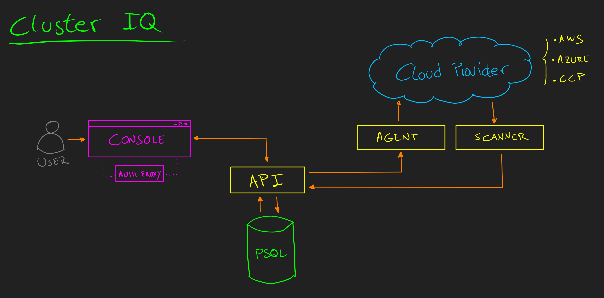

# Cluster IQ

[](https://goreportcard.com/report/github.com/RHEcosystemAppEng/cluster-iq)
[](https://pkg.go.dev/github.com/RHEcosystemAppEng/cluster-iq)


Cluster IQ is a tool for making stock of the Openshift Clusters and its
resources running on the most common cloud providers and collects relevant
information about the compute resources, access routes and billing.

Metrics and monitoring is not part of the scope of this project, the main
purpose is to maintain and updated inventory of the clusters and offer a easier
way to identify, manage, and estimate costs.

## Supported cloud providers

The scope of the project is to cover make stock on the most common public cloud
providers, but as the component dedicated to scrape data is decoupled, more
providers could be included in the future.

The following table shows the compatibility matrix and which features are
available for every cloud provider:

| Cloud Provider | Compute Resources | Billing | Actions | Scheduled Actions |
| -------------- | ----------------- | ------- | ------- | ----------------- |
| AWS            | Yes               | Yes     | Yes     | Yes               |
| Azure          | No                | No      | No      | No                |
| GCP            | No                | No      | No      | No                |


## Architecture

The following graph shows the architecture of this project:


## Documentation

The following documentation is available:

- [Events Documentation](doc/events/README.md) - Event flows and sequence diagrams
- [Development Setup](doc/development-setup.md) - Local development guide

## Installation
This section explains how to deploy ClusterIQ and ClusterIQ Console.


### Prerequisites:
#### Cloud provider RBAC configuration
Before configuring credentials for ClusterIQ, it is recommended to access the
user and permission management service and create a dedicated user exclusively
for ClusterIQ. This user should have the minimum necessary permissions to
function properly. This approach enhances the security of your public cloud
provider accounts by enforcing the principle of least privilege.

Each Cloud Provider has a different way for configuring users and permissions.
Before continuing, check and follow the steps for each Cloud Provider you want
to configure:

* **[Amazon Web Services (AWS)](./doc/aws-user-permissions-config.md)**
* **Microsoft Azure** Not available.
* **Google cloud Platform:** Not available.

#### Accounts Configuration
1. Create a folder called `secrets` for saving the cloud credentials. This folder is ignored on this repo to keep your
   credentials safe.
    ```text
    mkdir secrets
    export CLUSTER_IQ_CREDENTIALS_FILE="./secrets/credentials"
    ```
    :warning: Please take care and don't include them on the repo.

2. Create your credentials file with the AWS credentials of the accounts you
   want to scrape. The file must follow the following format:
    ```text
    echo "
    [ACCOUNT_NAME]
    provider = {aws/gcp/azure}
    user = XXXXXXX
    key = YYYYYYY
    billing_enabled = {true/false}
    " >> $CLUSTER_IQ_CREDENTIALS_FILE
    ```
    :warning: The values for `provider` are: `aws`, `gcp` and `azure`, but the
    scraping is only supported for `aws` by the moment.  The credentials file
    should be placed on the path `secrets/*` to work with
    `docker/podman-compose`.

    :exclamation: This file structure was design to be generic, but it works
    differently depending on the cloud provider. For AWS, `user` refers to the
    `ACCESS_KEY`, and `key` refers to `SECRET_ACCESS_KEY`.

    :exclamation: Some Cloud Providers has extra costs when querying the Billing
    APIs (like AWS Cost Explorer). Be careful when enable this module. Check your
    account before enabling it.

### Openshift Deployment
Since version 0.3, ClusterIQ includes its own Helm Chart placed on
`./deployments/helm/cluster-iq`.
For more information about the
   supported parameters, check the [Configuration Section](#configuration).
1. Prepare your cluster and CLI
    ```sh
    oc login ...

    export NAMESPACE="cluster-iq"
    oc new-project $NAMESPACE
    ```

2. Create a secret containing this information is needed. To create the secret,
   use the following command:
    ```shell
    oc create secret generic credentials -n $NAMESPACE \
      --from-file=credentials=$CLUSTER_IQ_CREDENTIALS_FILE
    ```

3. Configure your cluster-iq deployment by modifying the
   `./deployments/helm/cluster-iq/values.yaml` file.

4. Deploy the Helm Chart
    ```sh
    helm upgrade cluster-iq ./deployments/helm/cluster-iq/ \
      --install \
      --namespace $NAMESPACE \
      -f ./deployments/helm/cluster-iq/values.yaml
    ```

5. Monitor every resource was created correctly:
    ```sh
    oc get pods -w -n $NAMESPACE
    helm list
    ```

6. Once every pod is up and running, trigger the scanner manually for
   initializing the inventory
   ```sh
   oc create job --from=cronjob/scanner scanner-init -n $NAMESPACE
   ```


## Local Deployment (for development)
For deploying ClusterIQ in local for development purposes, check the following
[document](./doc/development-setup.md)


### Configuration
Available configuration via Env Vars:
| Key                                  | Value                                                 | Description                               |
| ------------------------------------ | ----------------------------------------------------- | ----------------------------------------- |
| CIQ_AGENT_INSTANT_SERVICE_LISTEN_URL | string (Default: "0.0.0.0:50051")                     | ClusterIQ Agent gRPC listen URL           |
| CIQ_AGENT_POLLING_SECONDS_INTERVAL   | integer (Default: 30)                                 | ClusterIQ Agent polling time (seconds)    |
| CIQ_AGENT_URL                        | string (Default: "agent:50051")                       | ClusterIQ Agent listen URL                |
| CIQ_API_LISTEN_URL                   | string (Default: "0.0.0.0:8080")                      | ClusterIQ API listen URL                  |
| CIQ_API_URL                          | string (Default: "")                                  | ClusterIQ API public endpoint             |
| CIQ_AGENT_LISTEN_URL                 | string (Default: "0.0.0.0:50051")                     | ClusterIQ Agent listen URL                |
| CIQ_AGENT_URL                        | string (Default: "")                                  | ClusterIQ Agent public endpoint           |
| CIQ_DB_URL                           | string (Default: "postgresql://pgsql:5432/clusteriq") | ClusterIQ DB URL                          |
| CIQ_CREDS_FILE                       | string (Default: "")                                  | Cloud providers accounts credentials file |
| CIQ_LOG_LEVEL                        | string (Default: "INFO")                              | ClusterIQ Logs verbosity mode             |
| CIQ_SKIP_NO_OPENSHIFT_INSTANCES      | boolean (Default: true)                               | Skips scanned instances without cluster   |


### Scanner
The scanner searches each region for instances (servers) that are part of an
Openshift cluster. As each provider and each service has different
specifications, the Scanner includes a specific module dedicated to each of
them. These modules are automatically activated or deactivated depending on the
configured accounts and their configuration.
```shell
# Building in a container
make build-scanner

# Building in local
make local-build-scanner
```

## API Server
The API server interacts between the UI and the DB.

```shell
# Building in a container
make build-api

# Building in local
make local-build-api
```

## Agent (gRPC)
The Agent performs actions over the selected cloud resources. It only accepts
incoming requests from the API.

Currently, on release `v0.4`, the agent only supports Power On/Off clusters on AWS.

```shell
# Building in a container
make build-agent

# Building in local
make local-build-agent
```

---
[](https://github.com/RHEcosystemAppEng/cluster-iq/actions/workflows/container-image-building.yaml)
---
