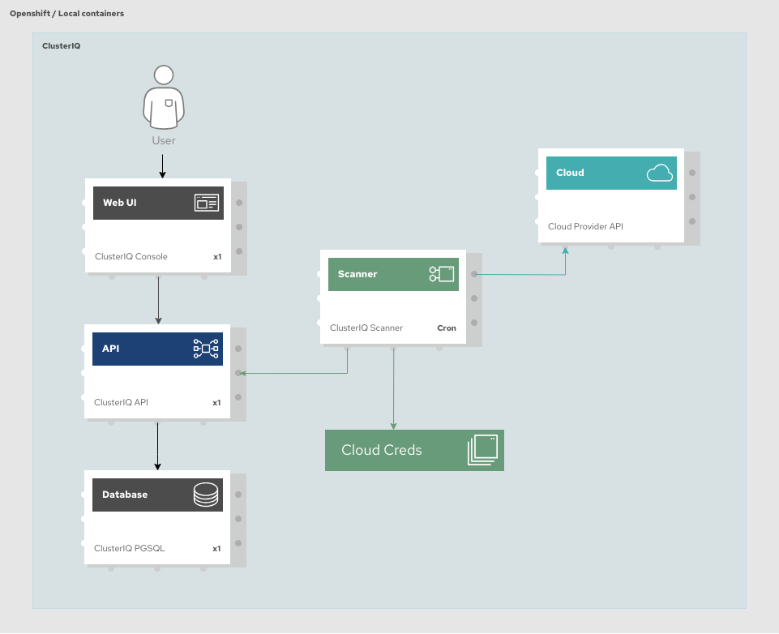

# Cluster IQ

[](https://goreportcard.com/report/github.com/RHEcosystemAppEng/cluster-iq)
[](https://pkg.go.dev/github.com/RHEcosystemAppEng/cluster-iq)

Cluster IQ is a tool for making stock of the Openshift Clusters and its
resources running on the most common cloud providers and collects relevant
information about the compute resources, access routes and billing.

Metrics and monitoring is not part of the scope of this project, the main
purpose is to maintain and updated inventory of the clusters and offer a easier
way to identify, manage, and estimate costs.

## Supported cloud providers

The scope of the project is to cover make stock on the most common public cloud
providers, but as the component dedicated to scrape data is decoupled, more
providers could be included in the future.

The following table shows the compatibility matrix and which features are
available for every cloud provider:

| Cloud Provider | Compute Resources | Billing | Managing |
|----------------|-------------------|---------|----------|
| AWS            | Yes               | No      | No       |
| Azure          | No                | No      | No       |
| GCP            | No                | No      | No       |


## Architecture

The following graph shows the architecture of this project:



## Getting started

### Credentials file

The file containing the access credentials to the cloud provider accounts
should look like this:

```text
[appeng]
provider = aws/gcp/azure
user = XXXXXXX
key = YYYYYYY
```

The credentials file must be located on the path `secrets/credentials` to work with `docker/podman-compose`.

To manage this on Openshift, a secret containing this information is needed.
Once you prepared your credentials file, run the following command to create the
secret:

```shell
oc create secret generic credentials \
  -n <NAMESPACE> \
  --from-file=credentials=<CREDENTIALS_FILE>
```

### Configuration

Available configuration via Env Vars:
| Key                  | Value                         | Description                               |
|----------------------|-------------------------------|-------------------------------------------|
| CIQ_API_HOST         | string (Default: "127.0.0.1") | Inventory API listen host                 |
| CIQ_API_PORT         | string (Default: "6379")      | Inventory API listen port                 |
| CIQ_API_PUBLIC_HOST  | string (Default: "")          | Inventory API public endpoint             |
| CIQ_DB_HOST          | string (Default: "127.0.0.1") | Inventory database listen host            |
| CIQ_DB_PORT          | string (Default: "6379")      | Inventory database listen port            |
| CIQ_DB_PASS          | string (Default: "")          | Inventory database password               |
| CIQ_CREDS_FILE       | string (Default: "")          | Cloud providers accounts credentials file |

These variables are defined in `./<PROJECT_FOLDER>/.env` to be used on Makefile
and on `./<PROJECT_FOLDER>/deploy/openshift/config.yaml` to deploy it on Openshift.

### Run local development environment

```shell
make start-dev
```

The local environment is started via `docker-compose`.

The following services are available:

| Service        | URL                   |
|----------------|-----------------------|
| UI             | <http://localhost:8080> |
| API            | <http://localhost:9000/clusters> |
| Redis          | 0.0.0.0:6379          |

### Scanners
[](https://quay.io/repository/ecosystem-appeng/cluster-iq-aws-scanner)

As each cloud provider has a different API and because of this, a specific
scanner adapted to the provider is required.

To build every available scanner, use the following makefile rules:

```shell
make build-scanners
```

By default, every build rule will be performed using the Dockerfile for each
specific scanner

#### AWS Scanner

The scanner should run periodically to keep the inventory up to date.

```shell
# Building
make build-aws-scanner
```


## API Server
[](https://quay.io/repository/ecosystem-appeng/cluster-iq-api)

The API server interacts between the UI and the DB.

```shell
# Building
make build-api

# Run
make start-api
```
