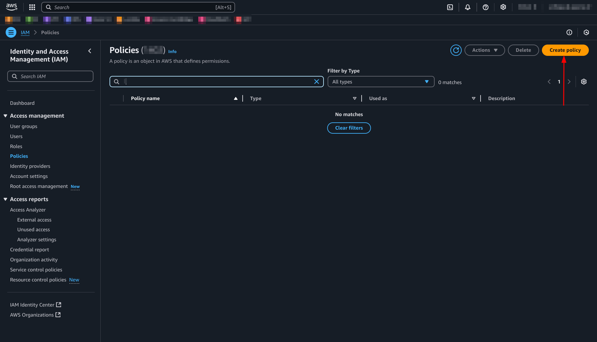
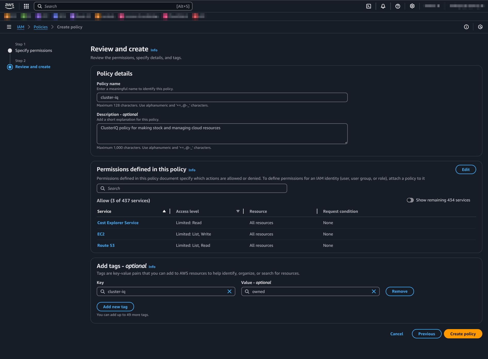
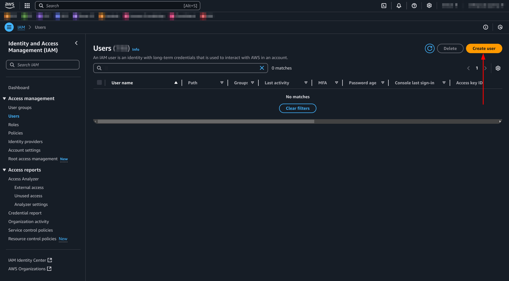
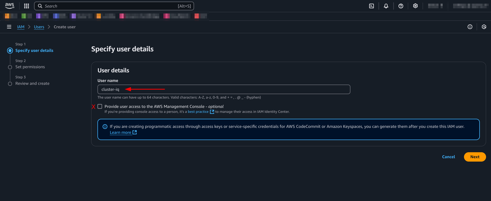
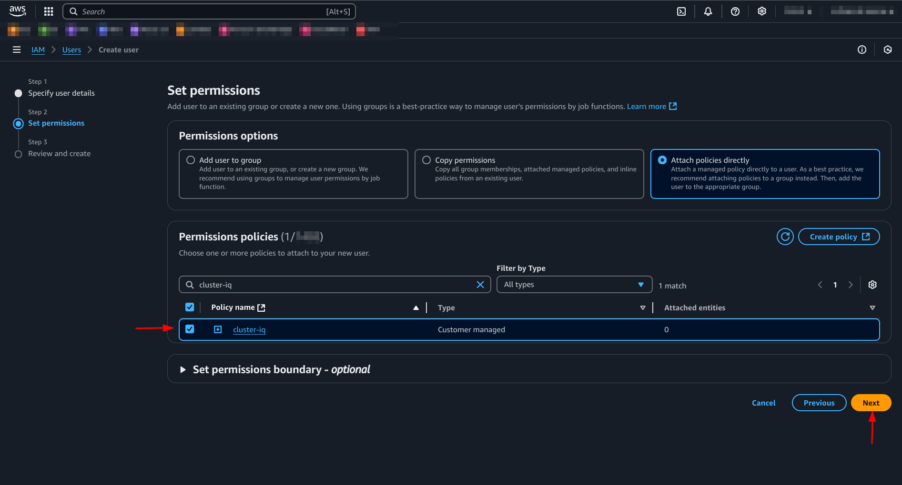
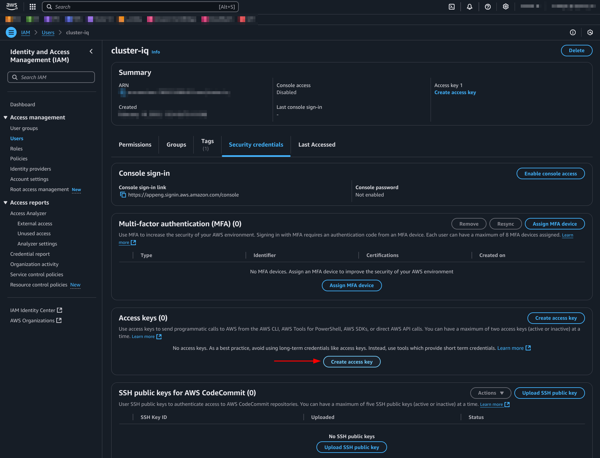
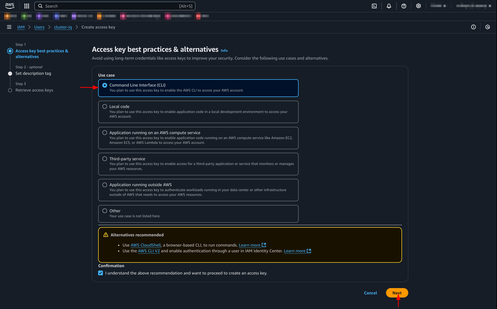

# AWS ClusterIQ user configuration
AWS has a service called **Identity and Access Management (IAM)** for managing
users, roles and policies. For creating and granting permissions for the
ClusterIQ user, follow one of the next sections.

## Using AWS Console
This section explains how to create an user and a policy for ClusterIQ using the Web Console
1. Log-in on the AWS console with a user with administrator permissions
2. Access to the IAM service
3. Click on "Policies" and then on "Create Policy"

4. Switch to `JSON` on the Policy Editor panel, and copy-paste the content of
   this [JSON file](./aws-cluster-iq-policy.json) in the Policy Editor
```json
{
    "Version": "2012-10-17",
    "Statement": [
        {
            "Effect": "Allow",
            "Action": [
                "ec2:DescribeInstances",
                "ec2:DescribeRegions"
            ],
            "Resource": "*"
        },
        {
            "Effect": "Allow",
            "Action": [
                "ec2:StartInstances",
                "ec2:StopInstances"
            ],
            "Resource": "*"
        },
        {
            "Effect": "Allow",
            "Action": [
                "ce:GetCostAndUsageWithResources"
            ],
            "Resource": "*"
        },
        {
            "Effect": "Allow",
            "Action": [
                "route53:ListHostedZonesByName",
                "route53:ListTagsForResource",
                "route53:ListResourceRecordSets"
            ],
            "Resource": "*"
        }
    ]
}
```

5. Add a policy name, description, and a tag for easier tracking of ClusterIQ
IAM configs. Once finished, review the permissions defined in this policy, and
press "Create Policy"  6. Click on
"Users" and then on "Create User" 
6. Assign `cluster-iq` as User name, and **DO NOT** check the console access
permissions, it will not be needed. When ready, press on "Next".

7. Select `Attach policies directly`, look for `cluster-iq` policy on the search bar, and mark the
checkbox. Finally, press Next 
8. Review all the parameters are correctly configured and press on Create User.
Optionally, assign a tag to the user like with the policy
9. Once the user is created and the policy assigned, look for `cluster-iq`
user on the users list, and open it. Then click on "Create Access Key".

10. Select `Command Line Interface (CLI)` on the Use Case options, and check
the confirmation message bellow. When ready, press Next.

11. As an optional step, include a description for the access key
and press Create access key
12. :warning: Note the Access Key and the Secret access key and keep them on a safe place!
13. Now you can use this access key as configuration for the credentials file.
Check the [README](../README.md) for more details.


## Using AWS CLI
This section explains how to create an user and a policy for ClusterIQ using the AWS CLI
1. Create the policy, and note the ARN
```sh
POLICY_ARN=$(
	aws iam create-policy \
		--policy-name cluster-iq \
		--policy-document file://doc/aws-cluster-iq-policy.json \
		--tags Key=cluster-iq,Value=owned \
	| jq '.Policy.Arn'
)

echo $POLICY_ARN
```

2. Create the User and assign the policy
```sh
USER_NAME="cluster-iq"
aws iam create-user \
  --user-name $USER_NAME \
  --tags Key=cluster-iq,Value=owned
```

3. Assign the policy to the user
```sh
aws iam attach-user-policy \
  --user-name $USER_NAME \
  --policy-arn $POLICY_ARN

```

4. Generate AccessKey and SecretAccessKey+
```sh
aws iam create-access-key --user-name cluster-iq
```
```json
{
    "AccessKey": {
        "UserName": "cluster-iq",
        "AccessKeyId": "********",
        "Status": "Active",
        "SecretAccessKey": "********",
        "CreateDate": "1970-01-01T00:00:00+00:00"
		}
}

```
