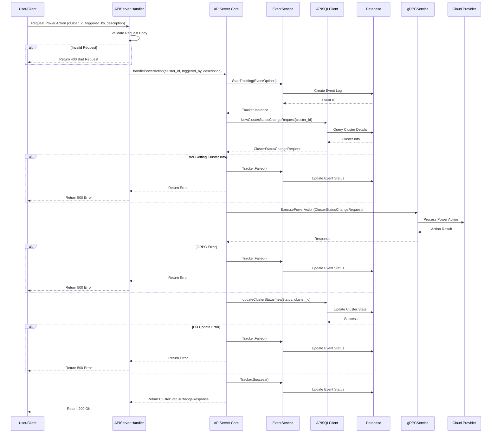

# Power Action Sequence

This diagram shows the abstracted flow for cluster power operations (PowerOn/PowerOff).

```mermaid
sequenceDiagram
    participant Client as User/Client
    participant Handler as APIServer Handler
    participant Core as APIServer Core
    participant Event as EventService
    participant SQL as APISQLClient
    participant DB as Database
    participant GRPC as gRPCService
    participant Cloud as Cloud Provider

    Client->>Handler: Request Power Action (cluster_id, triggered_by, description)
    Handler->>Handler: Validate Request Body
    
    alt Invalid Request
        Handler-->>Client: Return 400 Bad Request
    end

    Handler->>Core: handlePowerAction(cluster_id, triggered_by, description)
    
    Core->>Event: StartTracking(EventOptions)
    Event->>DB: Create Event Log
    DB-->>Event: Event ID
    Event-->>Core: Tracker Instance

    Core->>SQL: NewClusterStatusChangeRequest(cluster_id)
    SQL->>DB: Query Cluster Details
    DB-->>SQL: Cluster Info
    SQL-->>Core: ClusterStatusChangeRequest

    alt Error Getting Cluster Info
        Core->>Event: Tracker.Failed()
        Event->>DB: Update Event Status
        Core-->>Handler: Return Error
        Handler-->>Client: Return 500 Error
    end

    Core->>GRPC: ExecutePowerAction(ClusterStatusChangeRequest)
    GRPC->>Cloud: Process Power Action
    Cloud-->>GRPC: Action Result
    GRPC-->>Core: Response

    alt GRPC Error
        Core->>Event: Tracker.Failed()
        Event->>DB: Update Event Status
        Core-->>Handler: Return Error
        Handler-->>Client: Return 500 Error
    end

    Core->>SQL: updateClusterStatus(newStatus, cluster_id)
    SQL->>DB: Update Cluster State
    DB-->>SQL: Success
    
    alt DB Update Error
        Core->>Event: Tracker.Failed()
        Event->>DB: Update Event Status
        Core-->>Handler: Return Error
        Handler-->>Client: Return 500 Error
    end

    Core->>Event: Tracker.Success()
    Event->>DB: Update Event Status
    
    Core-->>Handler: Return ClusterStatusChangeResponse
    Handler-->>Client: Return 200 OK
```